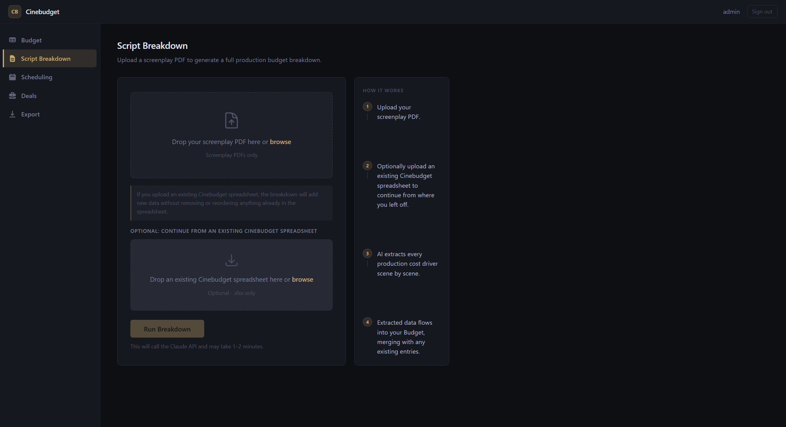
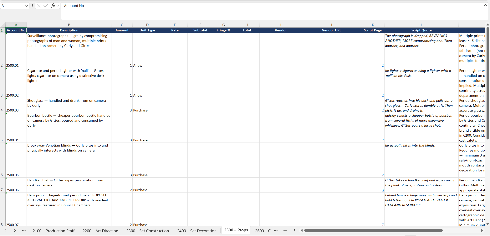
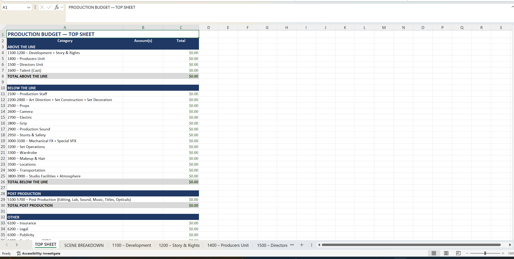

# Cinebudget
**AI-powered film production budget tool for indie filmmakers and line producers.**

Cinebudget reads a screenplay PDF and automatically extracts every production cost driver — props, locations, cast, stunts, VFX, wardrobe, legal clearances, and more — outputting a fully structured budget spreadsheet organized by industry-standard account numbers.

---

## What It Does

Upload a screenplay PDF. Cinebudget reads it the way an experienced 1st Assistant Director would — not just extracting explicitly named items, but inferring production costs from descriptive language, atmosphere, and implied action. The output is an Excel spreadsheet (.xlsx) organized by the same account numbering system used by Movie Magic Budgeting, the industry standard.

**Script Breakdown tab populates automatically:**
- Cast with scene counts per character
- Props with quantities, unit types, and script quotes
- Locations with permit flags
- Stunts with safety assessment notes
- VFX shot estimates
- Wardrobe per character
- Legal clearance flags for real trademarks, brands, and music on camera
- Night lighting, practical FX, and specialty camera requirements

**All other accounts** (Scheduling, Deals, Post Production) are present as structured placeholders — ready for a Line Producer or future tool integrations to populate.

---

## Screenshots of UI and Outputs




## Why It Exists

The standard workflow requires a 1st AD to manually read a script and create a breakdown sheet over 1-5 days, then hand it to a Line Producer who builds the budget. Cinebudget compresses the breakdown step from days to minutes, outputting data directly into a budget-ready format — eliminating the redundant transfer step between documents.

**Competitor:** Movie Magic Budgeting + Scheduling (~$1,200/year combined). Cinebudget targets indie producers ($500K-$5M budgets) who need professional-grade breakdowns without the cost or learning curve.

---

## Tech Stack

- **Backend:** Python 3.10+, Flask, Anthropic Claude API
- **Spreadsheet:** openpyxl
- **AI:** Claude Sonnet (5 grouped API calls per script, full PDF as base64 document)
- **Frontend:** HTML/CSS, Flask templates

---

## Running Locally

```bash
pip install -r requirements.txt
$env:ANTHROPIC_API_KEY='your_key_here' # PowerShell
python app.py
# Open http://localhost:5000 in your browser
```

---

## Project Structure

```
breakdown.py — CLI entry point, post-processing enforcer
api_client.py — 5 grouped Claude API calls
prompts.py — System prompt with all extraction rules
excel_writer.py — openpyxl spreadsheet generation
app.py — Flask web application
templates/ — HTML templates
static/ — CSS and assets
```

---

## Output Structure

Each output spreadsheet contains:
- **TOP SHEET** — one-line summary per account, auto-summed
- **SCENE BREAKDOWN** — one row per scene with all cost drivers tagged
- **35 account tabs** (1100 through 6400) — industry-standard MM account numbering
- SCRIPT-populated rows in green, SCHEDULE placeholders in yellow, DEAL placeholders in pink

---

## Status

- Tool 1 (Script Breakdown → Spreadsheet) — [live at http://3.21.29.86:5000](http://3.21.29.86:5000)
- Tool 2 (Pricing engine with live vendor API integrations) — planned

---

## Roadmap

Cinebudget is designed as a multi-input production budgeting platform. The Script Breakdown tool is the first of several planned input modules:

- **Scheduling** — upload a stripboard or Day-Out-of-Days to populate shoot day counts and schedule-driven costs
- **Deals** — upload crew and cast deal memos to populate negotiated rates and fringe calculations
- **Pricing Engine** — live vendor API integrations to auto-populate unit rates from real-world sources (equipment rental houses, SAG scale rates, location databases)
- **Live Budget** — Handsontable-powered in-browser spreadsheet that updates in real time as each input module runs
- **Export** — multi-format export including Excel, PDF, and Movie Magic-compatible output

The account structure of the current output is intentionally designed to accommodate all future inputs without restructuring.

---

Built by Becket Nelson | Eisen CUA AI Contest 2026
